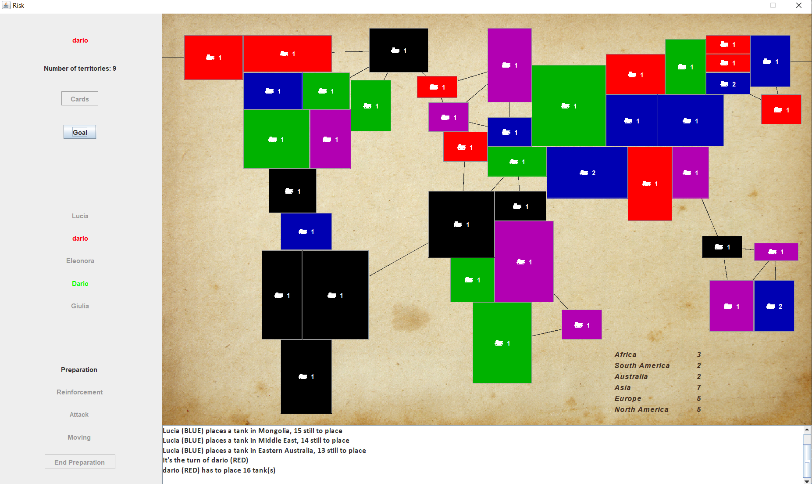

# fisk

The board game Risk implemented in Java using several design patterns:

1. Singleton
2. Factory
3. Builder
4. Object Pool
5. Observer
6. Mediator
7. State
8. Strategy
9. Facade

## English abstract

Realization of the famous board game Risk in JAVA language, using, where
possible and effective, the design patterns defined by GoF and SOLID principles.
The use of these techniques has contributed to face and solve some difficulties
encountered during the design and writing phases, obtaining at the end a quality
code, reusable and modifiable. The video game allows a real player to compete
with virtual players through a graphical interface created using the SWING
library of JAVA.

To better understand the implementation, please take a look at the
[UML class diagram](/doc/uml.svg)

## Italian abstract

Realizzazione del famoso gioco da tavola Risiko in linguaggio JAVA, utilizzando,
dove possibile ed efficace, i design pattern definiti dalla GoF ed i principi
SOLID. L’utilizzo di queste tecniche ha contribuito ad affrontare e risolvere
alcune difficoltà incontrate durante le fasi di progettazione e di scrittura,
ottenendo alla fine un codice di qualità, riutilizzabile e modificabile. Il
videogioco realizzato permette ad un giocatore reale di confrontarsi con dei
giocatori virtuali attraverso un’interfaccia grafica realizzata utilizzando la
libreria SWING di JAVA.

Per maggiori informazioni riguardo l'implementazione, dare un'occhiata al
[report](/doc/italian_project_report.pdf) e al
[diagramma delle classi UML](/doc/uml.svg)
